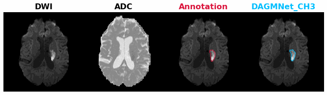
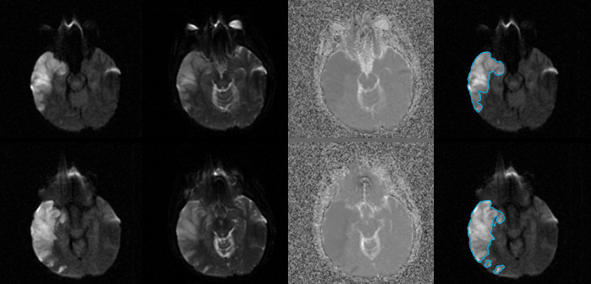
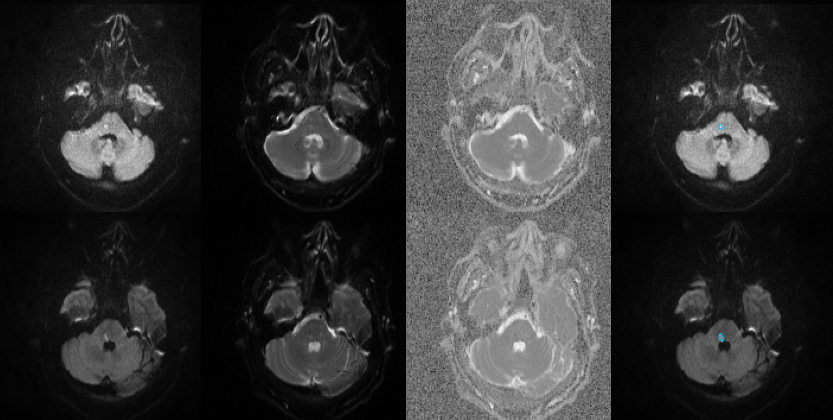

# Acute-stroke_Detection_Segmentation

## Introduction

In this study, we developed DL network ensembles for the detection and segmentation of acute and early subacute strokes in brain MRIs. Our network ensembles were trained and validated in 1390 clinical 3D images, and tested in 459 clinical 3D images, and evaluated on both MNI space and subject original raw space. To our best knowledge, this is the largest clinical set ever used. It is relatively much larger than the competitive study. In addition, we also evaluated our models on extra 499 not visible cases for false positive analysis. The results show our model ensembles are comparable to DeepMedic with comparable Dice score and precision but much lower false positive rate. We directly evaluated our models on an external dataset STIR (140 subjects for two image scan time points), which are clinical acute stroke subjects. The results show our model ensembles are generalized and robust on the external dataset. It sufficiently indicates our model has high potential in acute stroke detection application in clinical low-resolution images. The method fills all the requirements of speed, efficiency, robustness to data perturbs (e.g., imaging artifacts, low resolution, heterogeneity), and accessibility, for automatic acute stroke detection and segmentation.
<p align="middle">
    
</p>
<p align="middle">
    
    
</p>


## Directory
### Root
The `${ROOT}` is described as below.

```
${ROOT}
|-- data
    |-- Trained_Nets
    |-- examples
    |-- template
|-- codes
```

* `data` contains data like templates, image examples, and trained networks.
* `codes` contains ASD pipeline bin codes and the main function.

## Installation and Requirements
### Required Dependencies 

* python (version 3.7.7): Please make sure the version is at least 3.6+
* tensorFlow (version 2.0.0): The Deep Learning networks library for backend.
* niBabel (version 3.2.1): For loading NIFTI files.
* numpy (version 1.19.5): Gerenal computing array processing library.
* scipy (version 1.4.1): For image operation/processing. 
* dipy (version 1.4.0): For image registration
* scikit-image (version 0.18.1): For image operation/processing. 
* scikit-learn (version 0.24.1): Not necessary, but recommended to install as well, because we will update codes which has this dependency in the future. 

### STEP 1: Download ASD from github or google drive

Cloned the codes (for unix system, similar steps should be sufficient for Windows) with :
```
git clone https://github.com/Chin-Fu-Liu/Acute_Stroke_Detection/
```
If you are not familiar with github, you can just download the whole ASD package (ASD.zip file) from google drive [here (google drive) under uploading](https://drive.google.com/drive/) and unzip it to create the `Acute_Stroke_Detection` main folder locally.

### Download pre-trained networks :
1. Download pre-trained networks from [here (google drive) under uploading](https://drive.google.com/drive/)
2. Unzip and put all the models ('MODEL_NAMES.h5' files) directly under `Trained_Nets` folder that is under your `Acute_Stroke_Detection` main folder.


### STEP 2: Create virtual environment and activate the virtual environment:

We highly recommend creating a virtual enviroment for using this software. 

From a bash shell, create a virtual environment in a folder (FOLDER_FOR_ENVS/ENVS_FOLDER_NAME) that you want.

FOLDER_FOR_ENVS can be the path to the folder (`Acute_Stroke_Detection`) you create and clone from github or google drive.
ENVS_FOLDER_NAME can be any name you like, ex: `ASD_ENV`.

Using Conda:
```
conda create -p FOLDER_FOR_ENVS/ENVS_FOLDER_NAME python=3.6.5 -y
source activate FOLDER_FOR_ENVS/ENVS_FOLDER_NAME
```
Using Virtualenv:
```
virtualenv -p python3 FOLDER_FOR_ENVS/ENVS_FOLDER_NAME     # Use python up to 3.6+
source FOLDER_FOR_ENVS/ENVS_FOLDER_NAME/bin/activate      
```

###  STEP 3: Install all Dependencies as follows
```
$ pip install numpy nibabel scipy scikit-image scikit-learn
$ pip install dipy==1.4.0
$ pip install tensorflow==2.0.0 
$ pip install tensorflow-gpu==2.0.0
```
(We don't support GPU in this version, but it will be included in the next updated version. Hence, please also install `tensorflow-gpu`.)


### STEP 4: How to get new predict

Navigate to to the `/Acute_Stroke_Detection/codes` folder

In the `Acute_Stroke_Detection/codes` folder, run 

```bash
python ASDRun.py -input SUBJECTID_FOLDER 
                 -model DAGMNet_CH3
```

### The data format under `SUBJECTID_FOLDER` folder
`SUBJECTID_FOLDER` should be named by its SubjectID, in our example folder, we put it like `Subject01` or `Subject02`.
Each `SUBJECTID_FOLDER` folder should contain DWI and b0 images whose naming is as following:

`SubjectID_DWI.nii.gz`
`SubjectID_b0.nii.gz`

The naming is case sensitive.

### Options for ASDRun.py

For detail description, run -h for help as following
```
python ASDRun.py -h
```
`-input ` is the path for  `SUBJECTID_FOLDER`

`-model ` is the model name for segmenting lesions. It can be `DAGMNet_CH3`, `DAGMNet_CH2`, `UNet_CH3`, `UNet_CH2`, `FCN_CH3`, and `FCN_CH2`. They are pretrianed model by our data and specified in our paper [cite:]

`-save_MNI` is used to specify whether to save images in MNI (DWI, b0, ADC, Normalized DWI and, lesion predict). It's True by default.  you can turn it off as `-save_MNI False`

`-generate_report` is used to specify whether to generate lesion report. lesion report shows estimated lesion volume in total and in each vascular region or lobe area. It's True by default.  you can turn it off as `-generate_report False`

`-generate_result_png` is used to specify whether to generate the lesion predict result in a png file. In the png file, the order of columns are DWI, b0, ADC, and DWI aligned with lesion predict (blue contour) in the original image space. It's True by default.  you can turn it off as `-generate_result_png False`

For example, if you want to get a lesion predict on Subject01 with UNet_CH2 model, but not generating images in MNI and lesion report. You can run the following code in your virtual environment under the `Acute_Stroke_Detection/codes` folder.

```
python ASDRun.py -input PATH_to_Subject01_FOLDER 
                 -model UNet_CH2
                 -save_MNI False
                 -generate_report False
                 -generate_result_png True
```


## News
* 2021.04.16. examples are updated. 


## Reference  

## License 
This work is licensed under GNU General Public License v3.0, as found in the LICENSE file.

